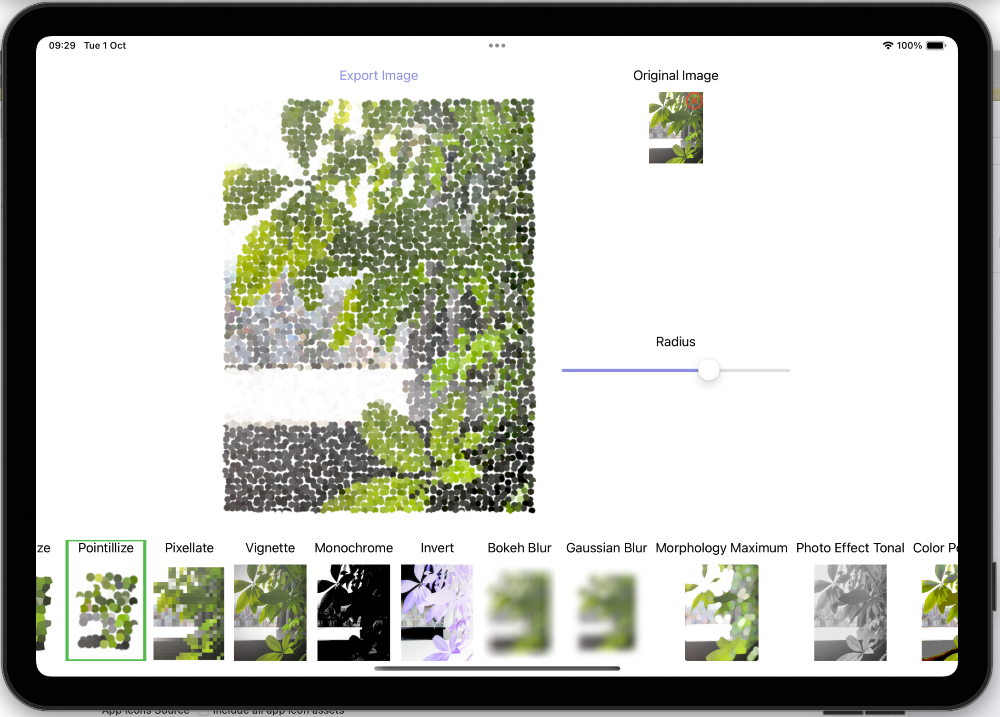
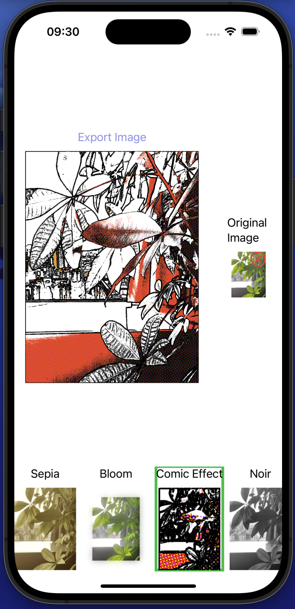

MarkOn is on [Test Flight public test](https://testflight.apple.com/join/R9qnqvpZ).

# MarkOn (Photos extension for iOS and macOS)

MarkOn is an iOS and macOS Photos extension and helper app written in swift that includes a variety of interesting Core Image filters (CIFilter).

It has been test on iOS 18 and macOS 15.0.

## Features

- **Privacy-Focused**: MarkOn prioritizes your privacy. Perform all edits within the Photos app without leaving it, making it perfect for handling private photos.
- **Comprehensive CIFilters**: A wide range of Core Image filters included.
- **Seamless Integration**: Easily integrates as a photo extension for quick edits.


## How to Build This Project

1. **Open the project in Xcode**.
2. **Change to your valid team** in **Signing & Capabilities**.
3. **Run the MarkOn target** for iOS or macOS.
4. The MarkOn extension will appear in the Photos app after building the app once.
5. You may also run the MarkOn extension target for iOS/macOS, then choose the Photos app.

## How to Use MarkOn as a Photo Extension

1. Open the **Photos** app.
2. Select a photo and choose **Edit**.
3. Tap on the **Extensions** button.
4. Select **MarkOn** to apply filters.
5. The original photo is always kept, you just need to tap "revert back to orginal" on the edit field to remove the filtered changes.

<!-- Github doesnot display gif in html  -->


## How to Use the MarkOn App

1. The app does not request access to your photo library.
2. You can **drag and drop** or **copy and paste** images into the app. It works on both iOS and macOS.





## Included CIFilters

MarkOn includes the following Core Image filters:

- **CISepiaTone**
- **CIBloom**
- **CIComicEffect**
- **CIPhotoEffectNoir**
- **CICrystallize**
- **CIPointillize**
- **CIPixellate**
- **CIVignette**
- **CIColorMonochrome**
- **CIColorInvert**
- **CIBokehBlur**
- **CIGaussianBlur**
- **CIMorphologyMaximum**
- **CIPhotoEffectTonal**
- **CIColorPosterize**
- **CIGlassDistortion**
- **CICircularScreen**
- **CICMYKHalftone**
- **CIDotScreen**
- **CIHatchedScreen**
- **CILineScreen**
- **CICannyEdgeDetection** *(only available on iOS 17 and above)*
- **CIEdges**
- **CIGloom**
- **CIGaborGradients**
- **CIHexagonalPixellate**
- **CILineOverlay**
- **CISobelGradients**
- **CIXRay**
- **CIScratchyFilm** (https://developer.apple.com/documentation/coreimage/simulating_scratchy_analog_film#2953507)

You can easily add more filters in `CIFilterEffect.swift`.

## Code Example

Here's an example of how to define a filter in MarkOn:

```swift
static let sepia = MarkonEffect(
    id: "CIFilter_Sepia",
    name: "Sepia",
    sliders: [
        SliderInfo(name: "Intensity", range: 0.0...1.0, step: 0.1, value: 0.8)
    ],
    cifilterProvider: { effect in
        guard let filter = CIFilter(name: "CISepiaTone") else { return nil }
        filter.setValue(effect.params[0], forKey: kCIInputIntensityKey)
        return filter
    }
)
```

## Contributions

Contributions are welcome! I am especially interested in other custom CIFilters and coreMLModelFilter that use Core ML models. Let me know if you have any suggestions. Enjoy!


## License

This project is licensed under the [MIT License](License.txt). 

**Important:** If you use this code in your project, you must include a link back to this [GitHub repository](https://github.com/abcde12321/Markon/).


## Resources

[Creating Photo Editing Extensions](https://developer.apple.com/documentation/photokit/creating_photo_editing_extensions/)
[Build Image and Video Style Transfer models in Create ML](https://developer.apple.com/videos/play/wwdc2020/10642/)

